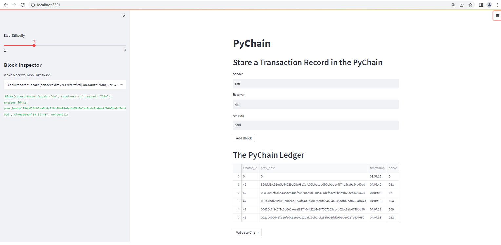

# Blockchain Validator
In Blockchain technology, a blockchain validator is a network node that helps process and validate transaction blocks on the platform so that they can be added to the permanent ledger of the blockchain. The program here utilizes the similar concept and demonstrates the process of adding new blocks, hashing the blocks and validating blocks by checking the hash value of previous block in the chain link.

### **Program Overview**

You’re a fintech engineer who’s working at one of the five largest banks in the world. You were recently promoted to act as the lead developer on their decentralized finance team. Your task is to build a blockchain-based ledger system, complete with a user-friendly web interface. This ledger should allow partner banks to conduct financial transactions (that is, to transfer money between senders and receivers) and to verify the integrity of the data in the ledger.

The Blockchain Validator simulates the steps involved in the process of new blocks creation and validations with a ceratin difficulty level. The major code blocks in the program does the following:

- Create a Record Data Class
- Modify the Existing Block Data Class to Store Record Data
- Add Relevant User Inputs to the Streamlit Interface
- Test the PyChain Ledger by Storing Records

---

**Required Frameworks:**

The program is written in Python 3.7.*. You may need the following libraries to work with the program.

- [hashlib](https://docs.python.org/3/library/hashlib.html) - Provides the SHA-224, SHA-256, SHA-384, SHA-512 hash algorithms in addition to platform optimized versions of MD5 and SHA1.
- [Streamlit](https://streamlit.io/) - Streamlit is an open-source Python library that makes it easy to create and share beautiful, custom web apps for machine learning and data science. It turns data scripts into shareable web apps in minutes.

---
## References

You may refer to some reference articles to understand the concepts of mining and blockchain validations in 'Proof of Work' here.

* [Blockchain Validators](https://tinyurl.com/4vh55x8w) - Blockchain validation process in a 'proof of work' process.
* [Difficulty Metric in Mining](https://en.bitcoin.it/wiki/Mining#The_Difficulty_Metric) - The difficulty is the measure of how difficult it is to find a new block compared to the easiest it can ever be in the blockchain.

## Usage

To use the Blockchain Validator program, clone the repository and load it in Visual Studio Code. Install Streamlit and other required packages to run the Python file ***pychain.py*** to make sure the code is well setup. Open Git Bash or other Python supported terminal, type 'streamlit run pychain.py' to launch the program in Streamlit Web UI. Make sure to check the path to ***pychain.py*** in your terminal.

***Note***: The 'Images' folder has snapshots of testing the validator on Streamlit web page. The 'Recording' folder contains the demo of the program.

## Blockchain Validator Demo

Follow the following path to view the program demo.

*Ref*: Recording/streamlit_recording.webm

---
## Unit Testing of Blockchain Validator

|Scenario: Adding New Blocks|
|:-:|
||

---

|Scenario: Validating Blocks|
|:-:|
||

---

## Contributors

FinTech Labs, Inc.

---

## License